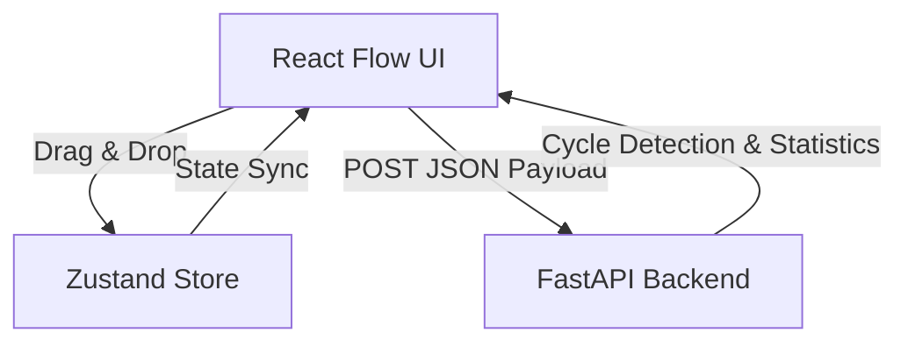

# VectorShift Pipeline Builder: Project Documentation & Agent Guide

This file provides a comprehensive overview of the VectorShift Pipeline Builder project, detailing its architecture, file structure, endpoint contracts, and core algorithmic mechanisms.

---

## 1. Project Overview & Architecture

The application is a visual workflow builder that allows users to create node-based generative AI pipelines by dragging components onto a canvas, wiring inputs and outputs, and analyzing the resulting graphs.



*   **Frontend (React & ReactFlow)**: Renders a drag-and-drop workspace utilizing [React Flow](https://reactflow.dev/) for canvas management. It stores nodes, edges, connections, and custom field states inside a global **Zustand** store.
*   **Backend (FastAPI)**: Performs graph analysis on the generated pipelines. It calculates the number of nodes, number of edges, and verifies whether the network forms a **Directed Acyclic Graph (DAG)** using DFS-based cycle detection.

---

## 2. Directory & File Structure

```text
VECTOR_SHIFT/
├── backend/                      # FastAPI Backend Directory
│   ├── main.py                   # Main FastAPI server (CORS, Endpoint, Cycle Validation)
│   └── requirements.txt          # Python dependencies (FastAPI, Uvicorn, Pydantic)
│
├── frontend/                     # React Frontend Directory (TanStack Start + TailwindCSS v4)
│   ├── src/
│   │   ├── components/           # Generic UI components
│   │   ├── hooks/                # Custom React hooks
│   │   ├── lib/                  # Helper libraries
│   │   ├── routes/               # Routing configuration
│   │   ├── pipeline/             # Core Pipeline Builder components
│   │   │   ├── BaseNode.jsx      # Abstract node container
│   │   │   ├── nodes/            # Pipeline nodes implementation
│   │   │   ├── pipeline.css      # Design system styling
│   │   │   ├── store.js          # Zustand store
│   │   │   ├── submit.jsx        # Submit request handlers & Modal results
│   │   │   ├── toolbar.jsx       # Canvas toolbar
│   │   │   └── ui.jsx            # ReactFlow canvas board
│   │   ├── server.ts             # Nitro server runner
│   │   └── styles.css            # Global CSS imports
│   ├── public/                   # Static public assets
│   ├── package.json              # Frontend package dependencies
│   ├── vite.config.ts            # Vite configuration
│   └── tsconfig.json             # TypeScript configuration
├── agent.md                      # This documentation file
└── implementation_plan.md        # Original implementation architectural plan
```

---

## 3. Detailed Component Descriptions

### Frontend Components (`frontend/src/pipeline/`)

*   **`BaseNode.jsx`**:
    A shared container layout that wraps all nodes. It renders node category labels, icons, name titles, a delete button (calling `onNodesChange` to delete the node), and maps custom target (left) and source (right) handles based on configuration.
*   **`nodes/textNode.jsx`**:
    Features two core dynamic behaviors:
    1.  **Dynamic Resizing**: The `<textarea>` length of the longest line and the total line breaks are computed on input, scaling the node's `width` and `height` dynamically.
    2.  **Dynamic Handles**: Uses regex `{{\s*([a-zA-Z_$][a-zA-Z0-9_$]*)\s*}}` to extract valid Javascript variable names typed inside double curly braces. These variables are mapped into target (left) input handles dynamically and spaced out evenly.
*   **`store.js`**:
    Provides Zustand store triggers:
    *   `nodes` & `edges`: Array structures containing standard ReactFlow elements.
    *   `updateNodeField(nodeId, fieldName, fieldValue)`: Propagates data entered inside input boxes back to the global state.
    *   `savePipeline()` & `loadPipeline()`: Persists and restores the active canvas structure to/from browser `localStorage`.
    *   `clearCanvas()`: Resets the canvas by wiping all nodes, edges, and index counters.
    *   `loadImportedPipeline(data)`: Restores a pipeline layout from an external JSON object structure.
*   **`submit.jsx`**:
    Pulls `nodes` and `edges` from the store on click, sends them to the backend, and opens a glassmorphic modal overlay reporting node metrics and verifying if the graph is a DAG. It also:
    *   Renders a Suggested Execution Path timeline illustrating the topological sort order of the nodes.
    *   Provides file handlers to export the layout as a local `.json` file and import/upload configuration files.
    *   Integrates clear canvas confirmation panels and success notification toast slide-ups.

### Backend Component (`backend/main.py`)

*   **FastAPI Application**:
    Runs an API server configured with CORS middleware allowing requests from `localhost:3000`.
*   **DAG Validation System**:
    Converts node coordinates and list configurations into an adjacency list representation `node_id -> [neighbor_id, ...]`. Runs a recursive Depth-First Search (DFS) tracking visited vertices and active paths on the recursion stack to check for cycle signatures.

---

## 4. Backend Endpoint Specification

### **POST** `/pipelines/parse`

Validates pipeline structures and checks for loops.

*   **Request Payload**:
    ```json
    {
      "nodes": [
        {
          "id": "text-1",
          "type": "text",
          "data": {
            "text": "Hello {{ name }}",
            "variables": ["name"]
          }
        }
      ],
      "edges": [
        {
          "id": "reactflow__edge-input_1-value-text_1-name",
          "source": "input-1",
          "sourceHandle": "input-1-value",
          "target": "text-1",
          "targetHandle": "text-1-name"
        }
      ]
    }
    ```

*   **Response Payload**:
    ```json
    {
      "num_nodes": 2,
      "num_edges": 1,
      "is_dag": true,
      "topological_order": ["Input (email)", "Text Prompt"]
    }
    ```

---

## 5. Local Operations Quickstart

### Running Backend
```bash
cd backend
# Make sure virtual env is active: (e.g. ..\.venv\Scripts\activate on Windows)
uvicorn main:app --reload --port 8000
```

### Running Frontend (Vite)
```bash
cd frontend
npm install
npm run dev
```
The React workspace will be accessible at `http://localhost:3000` (or the port shown in your terminal).

---

## 6. Development & Design Principles

When proposing modifications or writing code, agents and developers must strictly adhere to the following principles:
*   **Mobile-First Responsive Design**: Always approach layouts starting from mobile constraints first, expanding dynamically for desktop viewports. Ensure touch targets, fonts, and controls adapt seamlessly to small screens.
*   **Performant Code via Simplicity**: Write the simplest, most readable solution that solves the problem. Optimize for rendering efficiency, avoid redundant re-renders, and minimize bundle size.
*   **No Over-Engineering**: Do not introduce complex architectures, additional dependencies, or heavy abstractions unless absolutely necessary. Solve the immediate requirements first and maintain clear, simple structures.
